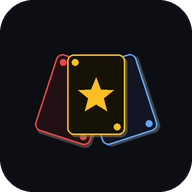
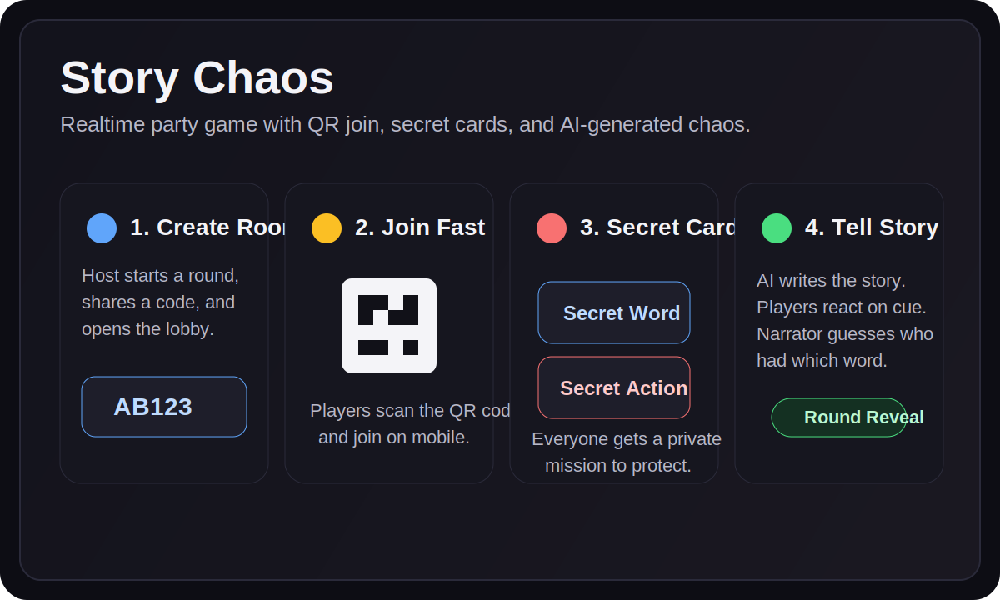

# Story Chaos

<p align="center">
  
</p>

> Das Echtzeit-Partyspiel, bei dem niemand unauffaellig bleibt.

**Story Chaos** ist ein browserbasiertes Multiplayer-Partyspiel fuer 2 bis 8 Spieler. Eine Person liest eine KI-generierte Geschichte vor, waehrend die anderen geheime Woerter und geheime Aktionen auf ihren Smartphones haben. Sobald das eigene Wort faellt, muss reagiert werden, ohne sich zu offensichtlich zu verraten.

## Live Demo

[storychaos-the-game.vercel.app](https://storychaos-the-game.vercel.app)

Auf dem iPhone laesst sich das Spiel auch wie eine App nutzen:
`Safari -> Teilen -> Zum Home-Bildschirm`

## Visual Preview



## Kurzueberblick

- 2 bis 8 Spieler
- ca. 15 bis 30 Minuten pro Runde
- Echtzeit-Multiplayer via QR-Code
- Handy-friendly, keine Installation notwendig
- KI-generierte Geschichten fuer jede Runde

## So Funktioniert's

1. Der Host erstellt einen Raum und bekommt einen QR-Code.
2. Die Mitspieler scannen den Code und treten mit ihrem Handy bei.
3. Der Host waehlt Schwierigkeit, Spielsprache und Wortkategorien.
4. Jeder Spieler erhaelt ein geheimes Wort und eine geheime Aktion.
5. Alle markieren sich als bereit.
6. Der Host waehlt ein Genre, dann wird eine passende Geschichte erzeugt.
7. Die Geschichte wird vorgelesen.
8. Immer wenn das eigene Wort faellt, muss die geheime Aktion ausgefuehrt werden.
9. Danach raet der Erzaehler, wer welches Wort hatte.
10. Aufloesung, Punkte, naechste Runde.

## Feature Highlights

- QR-Code Join fuer schnellen Einstieg
- Optionales Raum-Passwort
- Deutsche und englische UI
- Deutsche und englische Spielinhalte
- Mehr als 150 Woerter in mehreren Kategorien pro Sprache
- Schwierigkeitsstufen fuer Aktionen: `Leicht`, `Mittel`, `Chaos`, `Mix`
- Bereit-System vor Story-Start
- Einmaliges Neuziehen pro Spieler
- KI-Story-Generierung mit Fallback-Strategie
- Aufloesungsscreen mit allen Karten
- Punkte, Rangliste und Medaillen
- Rundenuebersicht mit bereits gewesenen Erzhaehlern
- Timer mit visuellen Signalen, Sound und Vibration
- Dark/Light Mode
- Offline-Hinweis
- Verstecktes Debug-Panel

## Bilingual Mode

Seit der bilingualen Erweiterung unterscheidet Story Chaos zwischen zwei Ebenen:

- `UI-Sprache`: Welche Sprache das Interface auf einem Geraet zeigt
- `Spielsprache`: Welche Sprache fuer Woerter, Aktionen und KI-Geschichten verwendet wird

Das bedeutet: Ein Host kann ein englisches Spiel starten, waehrend einzelne Spieler ihr Interface weiterhin auf Deutsch sehen.

Mehr dazu: [docs/bilingual.md](docs/bilingual.md)

## Tech Stack

- `React 18`
- `Vite`
- `Supabase` fuer Datenbank und Realtime-Sync
- `Pollinations.ai` fuer Story-Generierung
- `OpenRouter` als Fallback fuer KI-Anfragen
- `Vercel` fuer Hosting

## Lokal Starten

```bash
npm install
npm run dev
```

Danach laeuft die App lokal ueber Vite im Browser.

## Backend / Realtime

Das Spiel nutzt Supabase fuer Raeume, Spielerverwaltung, Realtime-Updates waehrend der Runde und Statuswechsel zwischen Lobby, Story, Aufloesung und Scoreboard.

## Projektstatus

Das Projekt ist spielbar und auf schnelle, mobile-first Runden mit Freunden ausgelegt.

## Naechste Ideen

- mehr Wortpakete und Themenwelten
- weitere Story-Genres
- feinere Balancing-Optionen fuer Aktionen
- bessere Auswertung pro Runde
- weiterer PWA-Ausbau

## Demo-Fokus

Wenn du das Projekt praesentierst, lohnt es sich besonders, den QR-Join, die geheimen Karten und den Story-/Aufloesungsfluss zu zeigen.

## Lizenz

Derzeit ist keine Lizenzdatei hinterlegt.
